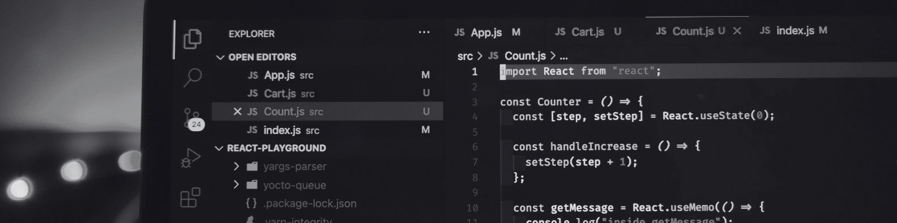

# Desarrollador FullStack | Next.js, NestJS, React, TypeScript

Desarrollo **soluciones a problemáticas** mediante software, con un **stack centrado en JavaScript**. Resido en Antofagasta, Chile.

👋 ¡Hola! Soy Daniel Cordero, desarrollador FullStack de Antofagasta, Chile. Me enfoco en crear soluciones eficientes y optimizar procesos a través del código. Trabajo con Next.js, NestJS, React y TypeScript, y siempre estoy aprendiendo algo nuevo para mejorar mis proyectos.

🚀 Empecé a programar en 2021 y desde entonces he desarrollado intranets, automatizado flujos de trabajo y optimizado sistemas para hacerlos más rápidos y eficientes.

🌱 Fuera del código, me gusta leer, ver series, jugar voleibol y videojuegos.

📬 Contáctame: daniel@melendez.dev

🔗 Portafolio: [melendezdev.dev](https://melendez.dev)

💼 LinkedIn: [Daniel Cordero Meléndez (@melendez.dev)](https://www.linkedin.com/in/melendezdev/)

## 🔥 Mis estadísticas

